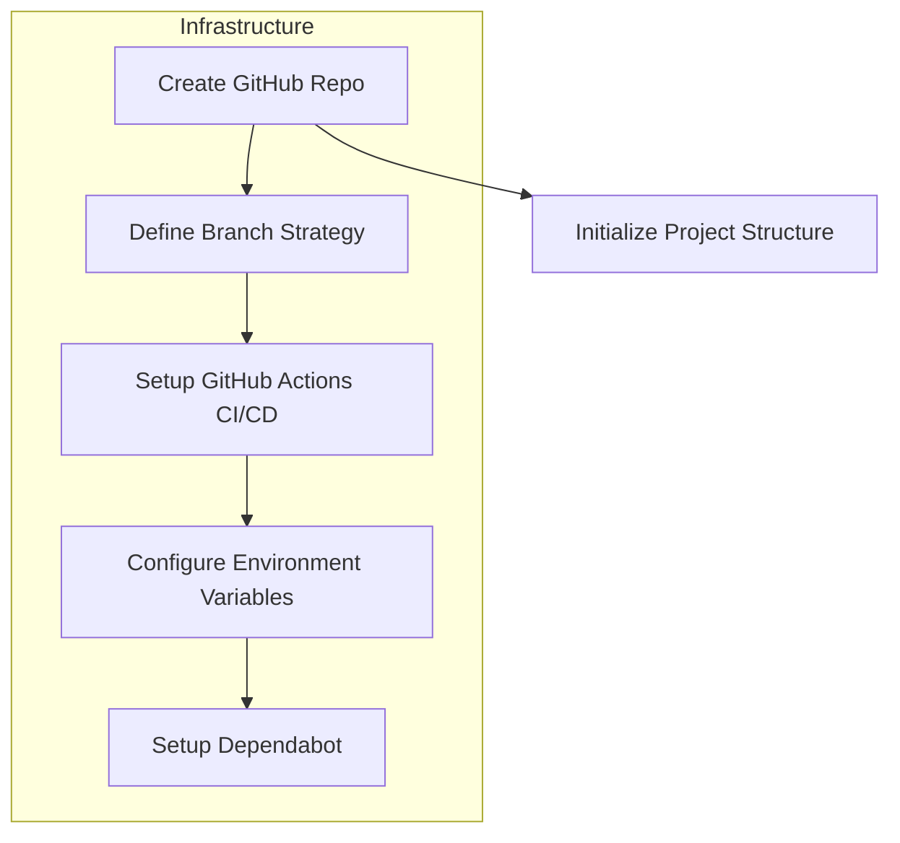
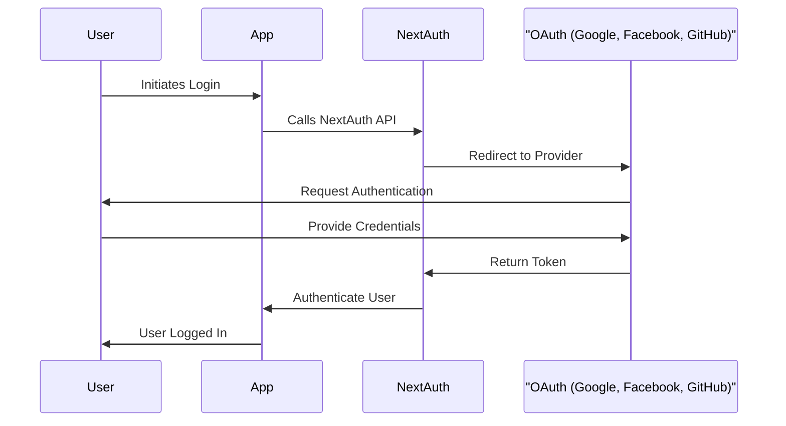
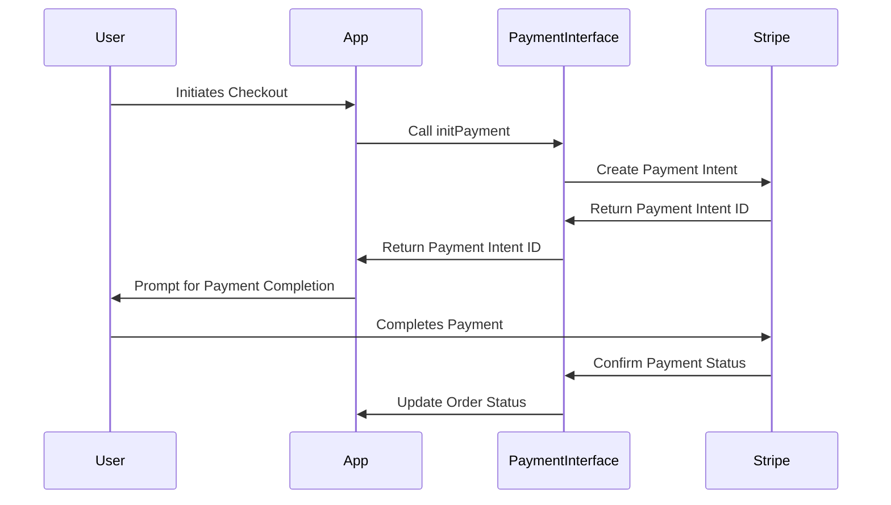

# Compustore Technical Project Guide

**Author**: [@stephane-segning]  
**Audience**: Development Team

## Table of Contents
1. [Project Infrastructure Setup](#1-project-infrastructure-setup)
2. [User Stories and Product Backlog](#2-user-stories-and-product-backlog)
3. [Development Environment Configuration](#3-development-environment-configuration)
4. [Diagrams](#4-diagrams)

---

## 1. Project Infrastructure Setup

Our priority is to establish a robust project infrastructure that supports a seamless development workflow, code quality, and continuous integration and deployment. The following steps outline how to set up our GitHub repository, CI/CD pipelines, and environment management for Compustore.

### 1.1 Repository Creation and Branching Strategy

1. **GitHub Repository**:
   - Initialize a private GitHub repository named `compustore`. Ensure it’s accessible to all team members with required permissions.
   
2. **Branching Strategy**:
   - **`main`**: The production-ready branch. Only stable, thoroughly reviewed code gets merged here.
   - **`develop`**: For active development. All feature branches merge into `develop` post-review.
   - **`feature/<feature-name>`**: For individual features or tasks. Short-lived and merged into `develop` upon completion.
   - **Branch Protection**: Protect both `main` and `develop` branches, requiring pull requests with reviews before merging.

**Diagram: Infrastructure Setup Workflow**



### 1.2 CI/CD Pipeline Setup

**Objective**: To automate testing, linting, and deployment.

1. **GitHub Actions (CI)**:
   - Create a `ci.yml` workflow file:
     - **Linting**: Run ESLint and Prettier on each commit.
     - **Type Checking**: Run TypeScript checks for consistency and type safety.
     - **Testing**: Run all unit and integration tests, with coverage requirements enforced.

2. **GitHub Actions (CD)**:
   - **Preview Builds on Vercel**: Configure automatic deployments of preview builds for each pull request on Vercel.
   - **Production Deployments**: Any merge to `main` should automatically trigger a production deployment.

3. **Dependabot**:
   - Enable Dependabot for dependency updates. It will raise pull requests when new versions of dependencies are available, reducing the likelihood of using outdated or vulnerable packages.

### 1.3 Environment Variables and Secrets

Vercel will manage our environment variables securely. These variables ensure that sensitive information like API keys and database credentials remain secure. 

| Environment        | Variable Name         | Description                           |
|--------------------|-----------------------|---------------------------------------|
| Development        | `NEXT_PUBLIC_STRIPE_KEY` | Stripe API key for development        |
| Staging            | `NEXT_PUBLIC_STRIPE_KEY` | Stripe API key for staging            |
| Production         | `NEXT_PUBLIC_STRIPE_KEY` | Stripe API key for production         |
| All Environments   | `DATABASE_URL`           | Neon.tech database URL                |
| All Environments   | `NEXTAUTH_SECRET`        | Secret for NextAuth encryption        |

### 1.4 Project Folder Structure

To maintain clarity and facilitate clean architecture, adhere to the following folder structure and naming conventions:

```
compustore/
├── src/
│   ├── components/           # Reusable UI components
│   ├── pages/                # Next.js pages
│   ├── hooks/                # Custom React hooks
│   ├── utils/                # Utility functions
│   ├── styles/               # Global CSS and Tailwind styles
│   └── lib/                  # Helper functions and library setup (e.g., Prisma, TRPC)
├── prisma/                   # Prisma schema and migrations
├── .github/
│   ├── workflows/            # GitHub Actions workflows for CI/CD
│   └── dependabot.yml        # Dependabot configuration for automatic dependency updates
├── tests/                    # Test files for unit, integration, and E2E tests
├── .eslintrc.js              # ESLint configuration
├── .prettierrc               # Prettier configuration
├── next.config.js            # Next.js configuration
└── README.md                 # Project documentation
```

---

## 2. User Stories and Product Backlog

### 2.1 User Stories

Each user story captures a requirement in terms of user functionality. These stories guide our development, ensuring that every feature delivers intended functionality and aligns with our security standards.

#### **Store and Product Management**

- **Anonymous User**: As an anonymous user, I want to browse products, so I can view available items before deciding to log in or purchase.
- **Authenticated User**: As a user, I want to add products to my cart, so I can purchase multiple items.
- **Admin**: As an admin, I want to manage product listings through an admin panel, so I can update and maintain the catalog.

#### **Authentication**

- **Anonymous User**: As an anonymous user, I want to log in using Google, Facebook, or GitHub, so I can securely access my account without creating a new password.
- **Admin**: As an admin, I want role-based access control, so I can manage store operations while preventing unauthorized actions.

#### **Payments and Orders**

- **Authenticated User**: As a user, I want to securely pay for items in my cart, so I can complete my purchase.
- **Admin**: As an admin, I want to capture order information and manage orders, so I can fulfill customer purchases.

### 2.2 Product Backlog and Sprint Planning

Our backlog and sprint planning organize tasks by development priority. Below is the proposed initial backlog:

| Sprint | Feature                    | Priority | Description                                                 |
|--------|-----------------------------|----------|-------------------------------------------------------------|
| 1      | Product Listings            | High     | Implement and display product listings.                     |
| 1      | Authentication              | High     | Set up NextAuth with Google, Facebook, and GitHub.          |
| 2      | Admin Panel - CRUD Products | High     | Develop the admin panel for product CRUD operations.        |
| 3      | Shopping Cart               | Medium   | Allow users to add items to a cart and view cart contents.  |
| 4      | Payment Integration         | High     | Implement payment processing using Stripe.                  |
| 5      | Order Management            | Medium   | Enable users to view their order history.                   |

**Diagram: Authentication Flow**



---

## 3. Development Environment Configuration

To maintain code quality and catch issues early, we’ll configure a strict development environment with pre-commit hooks, core dependencies, and structured folder conventions.

### 3.1 Pre-Commit Hooks with Husky

Utilize **Husky** for pre-commit hooks, which enforce code quality and formatting standards:

- **ESLint**: For consistent code style and error prevention.
- **Prettier**: For formatting standardization.
- **TypeScript**: Enforce type checks to avoid type-related errors during development.

### 3.2 Initializing Core Dependencies

1. **Install and Configure Next.js Plugins**:
   - **PWA**: Configure PWA capabilities for offline functionality in `next.config.js`.
   - **SEO**: Set up basic SEO configuration within `_app.js` and individual pages.
   - **NextAuth.js**: Integrate Google, Facebook, and GitHub providers to simplify user login.
   - **TRPC**: Initialize TRPC for type-safe communication between frontend and backend.

2. **Database Setup with Prisma**:
   - Define models for `User`, `Product`, and `Order` in `prisma/schema.prisma`.
   - Use `prisma migrate` to create tables on Neon.tech during setup.

3. **Redux and State Management**:
   - Set up Redux Toolkit for state management.
   - Integrate RTK Query with TRPC for streamlined data fetching and state management.

**Diagram: Payment Integration Flow**



### 3.3 Folder Structure and Naming Conventions

Adhere to the following folder structure for maintainability:

- **Components**: Use PascalCase for reusable UI components (e.g., `ProductCard.tsx`).
- **Pages**: Name pages in snake_case for route consistency (e.g., `product_details.tsx`).
- **Utilities and Hooks**: Organize helper functions in `lib/` and custom hooks in `hooks/`.

### Conclusion

This document provides a foundational framework for Compustore’s initial development phases, setting up a secure and efficient infrastructure, well-organized repository, and robust CI/CD workflows. Each team member is encouraged to follow these guidelines closely to maintain consistency, code quality, and security as we progress in development.

This is a constant todo file. By
- @stephane-segning
- @Valsuh45
- @Ngha-Boris
- @mbunwe-victor
- @kouamschekina
- @bryandino673
- @ArmandMeppa