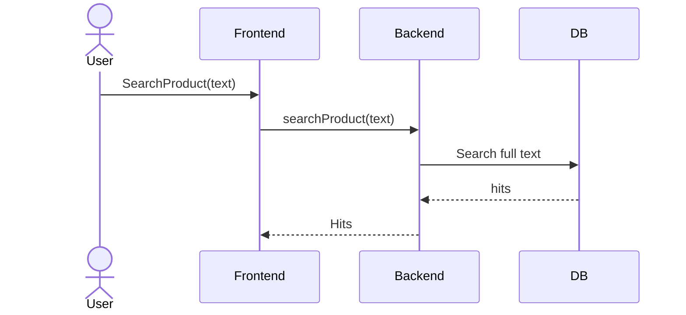

# Stripe Integration Demo Project

### Project Overview
The Stripe Integration Demo Project is a hands-on initiative designed to enhance the team’s expertise in Stripe's API and infrastructure. By building a full-stack application from scratch, the team aims to deepen their understanding of both the front-end and back-end components of Stripe-based systems. This project will also act as a foundational platform for the upcoming Payment Processor Project, which will be developed for commercial use.

### Key Objectives:

Build a full-stack demo application with Stripe integration using Next.js.
Develop a comprehensive understanding of the technologies involved in Stripe projects, such as payment processing, subscriptions, and invoice management.
Prepare for future Stripe projects by mastering relevant concepts and components.

### Project Goals 
Technical Proficiency: At the end of the project, each team member should be able to explain the technologies implemented, including the following components:

Front-end and back-end integration using Next.js.
Database management and TypeORM.
Stripe's payment processing and subscription management functionalities.
End-to-End Functionality: Implement a working end-to-end (E2E) application that demonstrates a complete Stripe workflow, including:

A Store with payment options.
One-time and subscription-based payments.
Invoice and subscription management.
Deployment and Maintenance: Develop strategies for deployment and ongoing maintenance of the application.

### Tech Stack
The project will leverage the following technologies:

Next.js: Chosen for both front-end and back-end development due to its popularity and recent adoption in Stripe projects.
React: For building responsive and interactive user interfaces.
Express: For handling server-side logic.
TypeORM: For database management and modeling.
NextAuth.js: To manage authentication, with custom configuration for compatibility with our backend.
Other Libraries: Abstract classes, plugins, and third-party resources as needed.
Timeline and Milestones
The estimated project duration is 8 to 10 weeks. Key milestones include:

Project Setup & Initial Development (Weeks 1-2): Establish the tech stack and create the initial project framework.
Store & Payment Features (Weeks 3-6): Develop the store functionality, including one-time and subscription payments.
Invoice & Subscription Management (Weeks 6-8): Implement invoice management and subscription handling.
Testing & Review (Week 9): Conduct extensive testing, review sequence diagrams, and make necessary adjustments.
Deployment & Maintenance Strategy (Week 10): Prepare for deployment and finalize the project documentation.
Features and Requirements
The application will include the following key features:

### Store:

Product listings, order management, and checkout functionality.
Payments:

Support for one-time and subscription payments through Stripe.
Invoice Management:

Integration with Stripe for managing invoices and billing.
Authentication:

User login and authentication using NextAuth.js.
Session management to identify logged-in users using the useSession hook.

### Admin Panel:

Using React Admin (RA) to handle CRUD operations for products and orders.
Custom pages for product and order management.
Configurations to ensure backend connectivity and secure authentication.
Technical Considerations
Abstract Classes and Plugins: We will utilize abstract classes and plugins for code reusability and modularity.
Progressive Web App (PWA): Research has been conducted on how to implement PWA features, including triggering installations.

### Development Methodology
For this demo project, we are following a collaborative workflow to ensure consistent progress. Additionally:

Scrum Framework: We will implement Scrum practices, including a monthly Spring Demo to present progress and gather feedback.
Kanban Board: To track tasks and maintain progress transparency. Managed by @Stephane Segning Lambou and @Armand Meppa.

### Diagrams and Visual Documentation
To aid in understanding and clarity, we will be creating and reviewing the following diagrams:

Project Overview Diagram: Visual representation of the overall project structure and workflows.

UML Sequence Diagrams: Detailed sequence diagrams for critical components, such as "Subscribe to Product License" and "Manage Subscriptions."

 
### Research & Additional Tools
React Admin (RA):

Setup: Establish connection with the backend and authentication using NextAuth.js.
Configuration: Simple, with pages for orders and products.
Customization: Advanced, focusing on theme customization and additional features.
NextAuth.js: Custom configuration for authentication, including handling sessions to retrieve logged-in clients.

No-Code Technologies: @Stephane Segning Lambou presented on no-code technologies, exploring their potential for future projects.

Design Tools: We had an introductory session on Figma for UI design exploration and basic prototype handling.

### Pending Topics
Project Name: The name for this project is still to be decided.
Deployment Models and Maintenance: Final decisions on deployment and long-term maintenance are yet to be made.